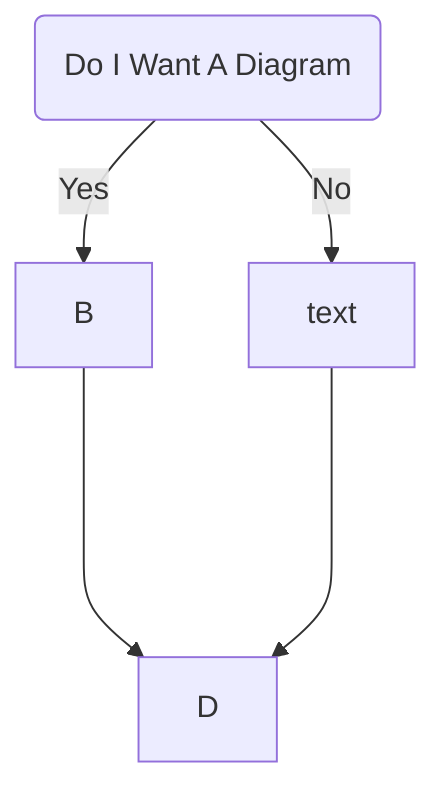
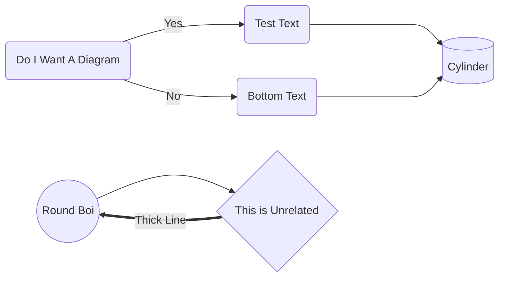

# Creating .md Diagrams with Mermaid







## Explanation

> graph TD = graph top down <br>
>  graph LR = graph left right


## Style

Styles can be used:

```
style id1 fill:#f9f,stroke:#333,stroke-width:4px
style id2 fill:#bbf,stroke:#f66,stroke-width:2px,color:#fff,stroke-dasharray: 5 5
```

Including Default Class:

```classDef default fill:#f9f,stroke:#333,stroke-width:4px;```

```mermaid
graph LR
%% This is a comment 
A(Start):::darkBlue ==>B(Stop):::brightOrange;
B(Stop):::brightOrange ==> C(Reset?);
C(Reset?) == yes ==> A;
C(Reset?) == No ==>D{end}

classDef darkBlue fill:#333,stroke:#06f,stroke-width:4px;
classDef brightOrange fill:#eee,stroke:#e90,stroke-width:3px;
classDef default fill:#222,stroke:#bbb,stroke-width:2px;
%%class nodeId1, nodeId2 darkBlue;
```





'''https://mermaid-js.github.io/mermaid/#/flowchart'''


